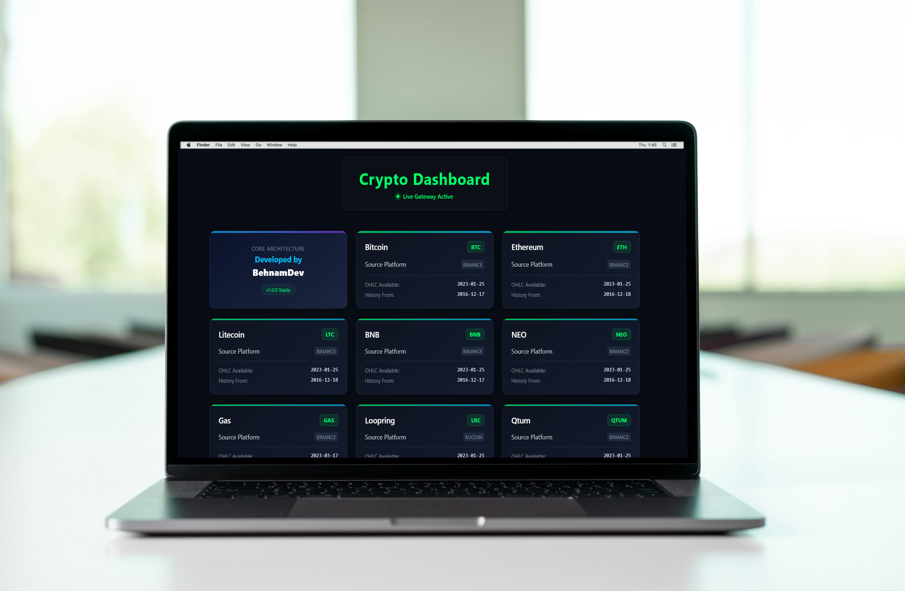
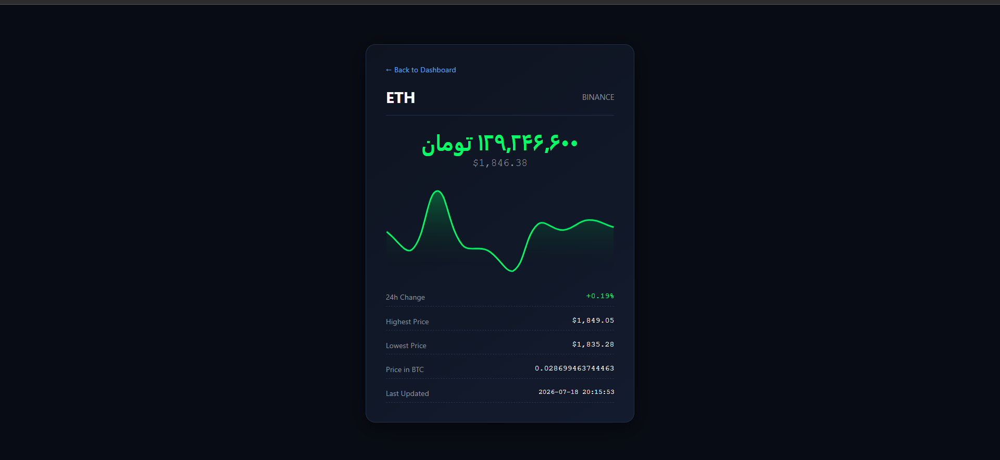

<div align="center">

# 🚀 Cryptography API Gateway

<p align="center">
  
</p>

### A Modern Cryptocurrency REST API Gateway Built With Ktor

یک سرویس بک‌اند مدرن مبتنی بر **Ktor** که به عنوان یک **Crypto API Gateway** عمل می‌کند.

این پروژه امکان دریافت لیست ارزهای دیجیتال و مشاهده اطلاعات دقیق هر ارز را از طریق REST API فراهم می‌کند.

ساختار پروژه بر اساس **Clean Architecture** طراحی شده و با استفاده از **Docker** قابل استقرار است.

</div>

---

# 📸 Screenshots

<div align="center">




</div>
---

# ✨ Features | قابلیت‌ها

## 🇺🇸 Features

- Cryptocurrency list API
- Cryptocurrency detail API
- RESTful API
- Clean Architecture
- Dependency Injection with Koin
- Kotlin Coroutines
- Ktor HTTP Client
- Docker Containerization
- Railway Deployment


## 🇮🇷 قابلیت‌ها

- دریافت لیست ارزهای دیجیتال
- نمایش اطلاعات دقیق هر ارز دیجیتال
- پیاده‌سازی REST API
- معماری Clean Architecture
- مدیریت وابستگی‌ها با Koin
- پردازش غیرهمزمان با Kotlin Coroutines
- ارتباط با API خارجی با Ktor Client
- استقرار با Docker و Railway

---

# 🛠 Tech Stack

| Technology | Usage |
|---|---|
| Kotlin | Programming Language |
| Ktor Server | Backend Framework |
| Ktor Client | HTTP Communication |
| Koin | Dependency Injection |
| Kotlin Coroutines | Async Processing |
| Docker | Containerization |
| Clean Architecture | Project Architecture |
| HTML5 | Dashboard |
| CSS3 | Styling |
| JavaScript | Frontend Interaction |

---

# 🔥 Live API

Base URL:
<p style="align:center;">وی پی ان میخواد!</p>

<a href="https://cryptography.up.railway.app">لینک وب اپلیکیشین</a>


---

# 🔌 API Endpoints

## 🪙 Get Cryptocurrency List

دریافت لیست ارزهای دیجیتال


### GET

```http
GET https://cryptography.up.railway.app/cryptoList
```

---

## 🔍 Get Cryptocurrency Details

دریافت اطلاعات کامل یک ارز دیجیتال


### GET

```http
GET https://cryptography.up.railway.app/btc
```

---

# 📊 API Overview

| Method | Endpoint | Description |
|---|---|---|
| GET | `/cryptoList` | دریافت لیست ارزهای دیجیتال |
| GET | `/btc` | دریافت اطلاعات یک ارز دیجیتال |

---

# 🏗 Architecture

این پروژه بر اساس **Clean Architecture** ساخته شده است.


```text
              Presentation Layer

        Routes • API • Dashboard

                    │

                    ▼

                Domain Layer

      Models • UseCases • Repository

                    │

                    ▼

                 Data Layer

    Repository • Remote API • Ktor Client
```

---

# 📂 Project Structure


```text
src
│
├── data
│   ├── remote
│   ├── repository
│   └── model
│
├── domain
│   ├── model
│   ├── repository
│   └── usecase
│
├── presentation
│   ├── routes
│   └── dashboard
│
└── di
```

---

# 🐳 Docker

Build Image:

```bash
docker build -t cryptography-api-gateway .
```

Run Container:

```bash
docker run -p 8080:8080 cryptography-api-gateway
```

Server:

```text
http://localhost:8080
```

---

# 🚂 Deployment

The project is deployed using:

```text
Docker + Railway
```

Live Server:

```text
https://cryptography.up.railway.app
```

---

# 🎯 Project Goals

- Building a scalable backend service with Ktor
- Applying Clean Architecture principles
- Creating a reusable Crypto API Gateway
- Learning backend development with Kotlin
- Preparing production-ready API structure

---

# ❤️ Built With

<div align="center">

Kotlin • Ktor • Koin • Docker • Clean Architecture

</div>
</div>
